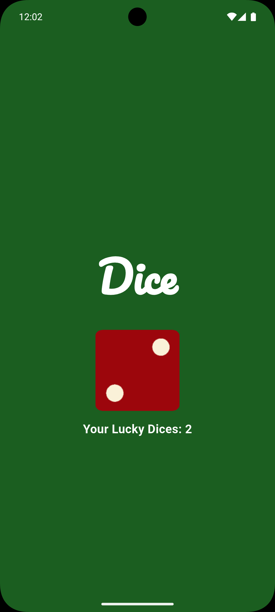

# dice_app

A simple and fun Flutter app that simulates a **dice roll** 🧊🎲.  
This app includes a **dice image** that changes on tap, along with **sound effects** to enhance the user experience.

## 📱 Screenshot

> *(Make sure to save your screenshot as `dice_app_screenshot.png` inside a folder named `screenshots` in your project directory.)*

## Getting Started

This project is a starting point for learning Flutter development.

Resources to help you get started:

- [Lab: Write your first Flutter app](https://docs.flutter.dev/get-started/codelab)
- [Cookbook: Useful Flutter samples](https://docs.flutter.dev/cookbook)

For more guidance, visit the [official Flutter documentation](https://docs.flutter.dev/) for tutorials, samples, and API references.
